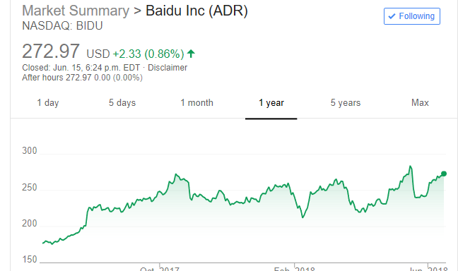

On May-18-2018, Baidu COO Lu Qi leaves baidu and then the price plunged 15%. 

I did not have any thoughts on it but looked into Lu Qi's career life. I admired him as he can be honored as First Asian in NA tech field.

On Jun-1-2018, Baidu's stock came back to 260 which is 8% increase from its bottom or 6% drop from its high. As I believed that a man should only have limited impact on one stock. For example, Steve Jobs and AAPL.
Therefore, I bought BIDU on $259