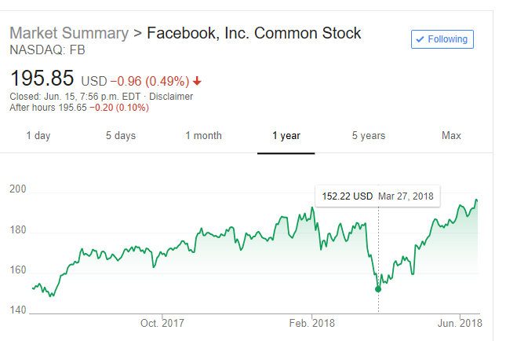

On Mar-16-2018, news released that FB may leak 87 million people's data. Stock price dropped 9% on that date. I bought a lot of FB stocks. 

On Mar-27-2018, FB continue losing to bottom point 152 testing its supporting line. I bought another round at 160. 

On May-11-2018, FB is back at its original price 185.

The reason I dared to buy in is because I believe in it and I think stupid people overracted. 

First, it is not FB's fault to leak the data. Cambridge Analytics used FB's contract loophole to make their profit.

Second, it is already to everyone's knowledge that people are selling our data. 

Therefore, I believe FB will be back at its original price soon. I just didn't expect to be that soon.