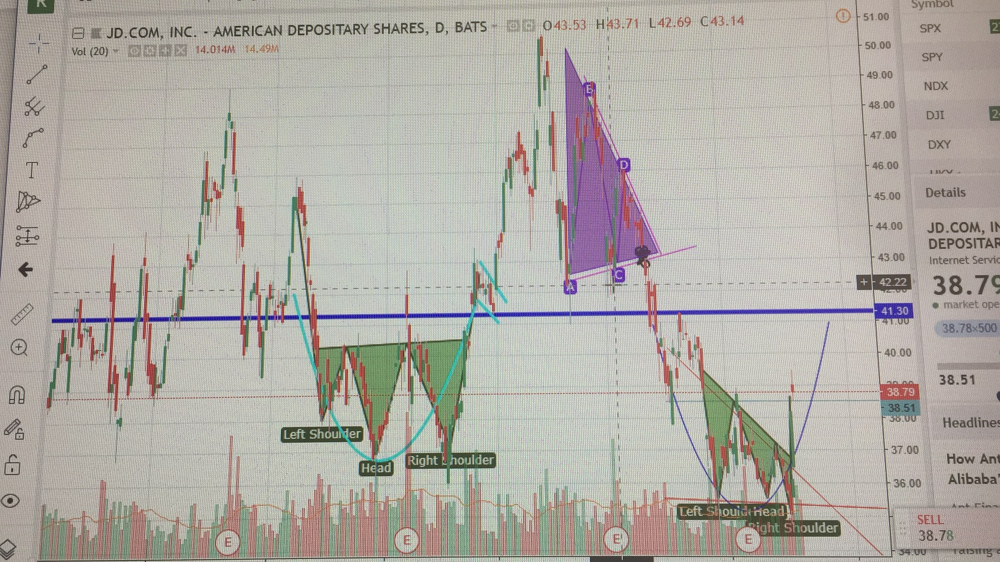
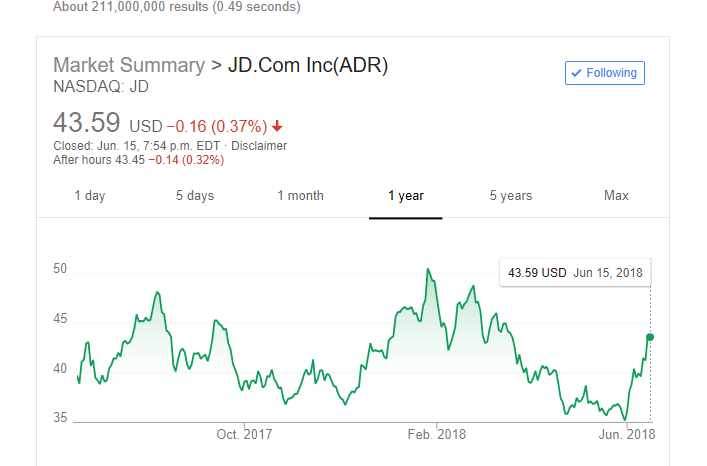

In 2018-06-05, first time ever, i have made my chart. 

From left to right, the first shoulder head pattern comfired by cup holder pattern which gives a bull trend after break out. And the descending triangle correctly predicts the fall on JD.

The second shoulder head pattern is not really a shoulder head pattern. It's neck line is not horizental, but I use it to see a falling wedge and tripple bottom. Together with rounding bottom, I bought JD at $37

Update on 2018-06-016: 

Now JD is $43. I still think it can go higher with absolutely no proof. And I think this is a bad practice and I should not do this. Probability of the price dropping is quite high.