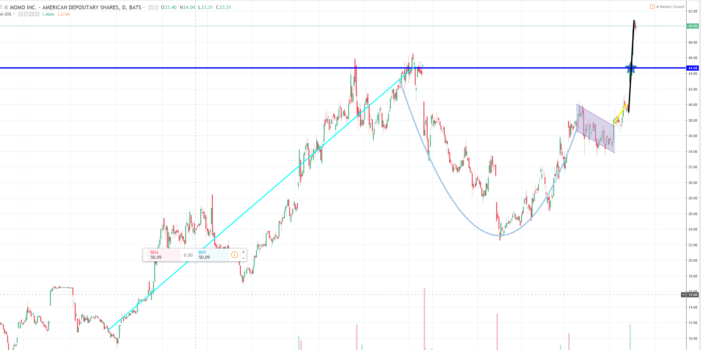
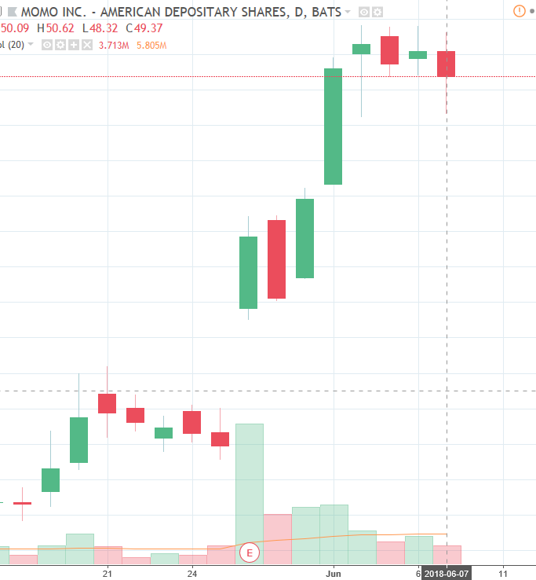

As financial result gives 64% increase in net revenues, 21% increase in MAU and 57% Non-GAAP net income attributable, MOMO stock compared to last year, 2017, should at least increase around 20%. 

On 05-29-2018, I estimated the stock price sorely based on the financial result with last year the stock at the same time. The price I gave was 48-50. 

However, based on the new chart pattern I learned, I see a cup holder pattern. At the end of the holder, a yellow trend line was drawn. MOMO's stock was already on an advance. 

Therefore, based on the two things I observed, with a little hope to the stock itself. I estimate the resistance level, in line with others prediction, is about 60. 

Update: Not enough information yet, but after two-three days of the boost, the buy power of MOMO is not very strong, even though the sell powser is not strong either. This power lowers the confidence of me about MOMO stock, so I want to lower my resistance level price to 56-58.

